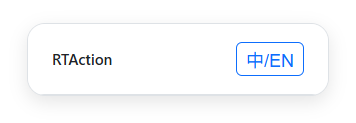

# RTAction

RTAction is a browser-based [Tampermonkey](https://www.tampermonkey.net/) script that extracts audio waveform features from web-page videos and converts the analysis results into real-time serial commands to drive external hardware devices.

**V1.3**  

## Supported Websites

* `youtube.com`
* `bilibili.com`

## Installation

0. Your browser must support the [Web Serial API](https://developer.mozilla.org/en-US/docs/Web/API/Web_Serial_API). Chrome or Edge is recommended.

1. Install the [Tampermonkey](https://www.tampermonkey.net/) extension.

2. In Tampermonkey, click **“Create a new script...”**

3. Copy the content of **`RTAction.js`** into the editor and save.

## Usage

0. Connect a supported device to your computer via USB. The baud rate **must be `115200`**.

1. Open any supported video page. You may need to refresh the page.

2. Click the **“Select Serial Port”** button and choose the device's serial port.
   (Do NOT connect the same serial port from multiple tabs — this will cause conflicts! Refreshing the page will disconnect the port.)

3. Play the video and adjust the volume to an appropriate level.
   *(The video volume significantly affects the motion amplitude.)*

## How It Works

1. Retrieve audio data using `AudioContext + MediaElementSource`.

2. Extract waveform data using `AnalyserNode` and compute RMS.

3. Process the RMS value and linearly map it to the range **0–9999**.

4. Send commands to the serial device at fixed intervals via the Web Serial API.

## License

For learning and personal use only. Commercial use or abuse in any form is prohibited.